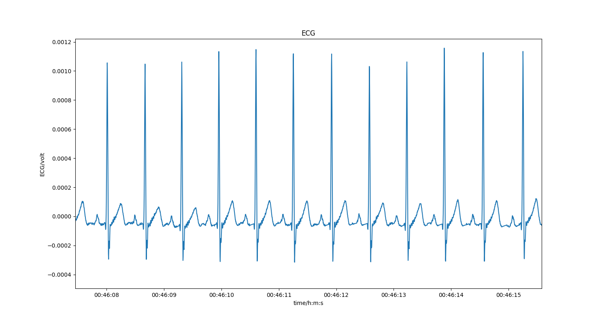

# Sleep EEG and ECG

Recording of EEG (Fp1 vs A1) and ECG (II) during about 3 hrs of sleep. The person was then woken up.

## Usage

The class `SleepEEGECG` loads the raw eeg/ecg file and then you can access the EEG and the ECG.

```
    class SleepEEGECG(builtins.object)
     |  Class which loads the EEG/ECG recording and you can then access the
     |  data then via its methods.
     |  
     |  getECG(self)
     |      Returns the ECG data in mV. Note that the amplifier was not calibrated so its only approximate.
     |  
     |  getEEG(self)
     |      Returns the EEG data in volt.
     |  
     |  getTimeAxis(self)
     |      Returns a numpy array of the time axis in seconds of the whole recording.
     |  
```

## Example program

This program plots the EEG, ECG and the heartrate.

Install the R-peak detector library:

```
pip install py-ecg-detectors
```

Then run:

```
python explore.py
```



